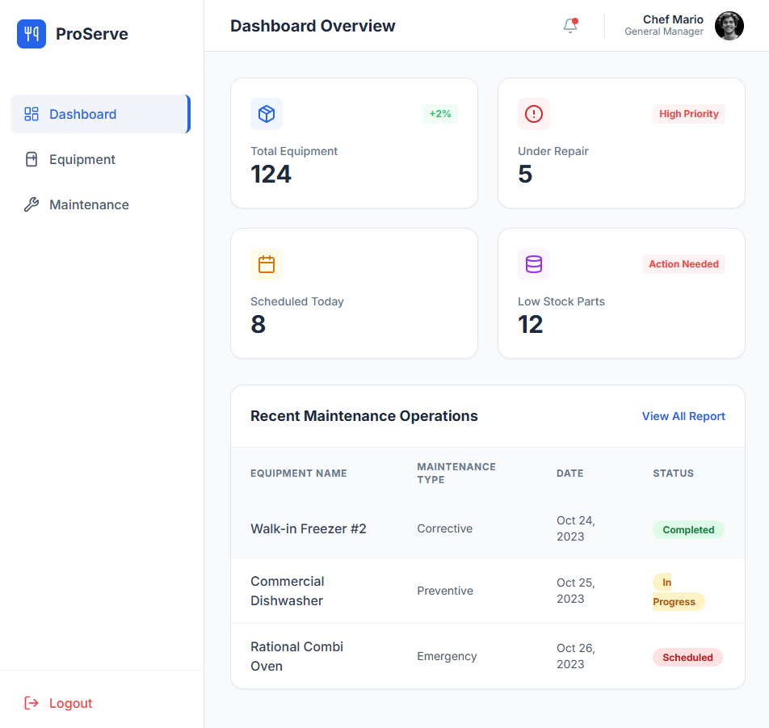
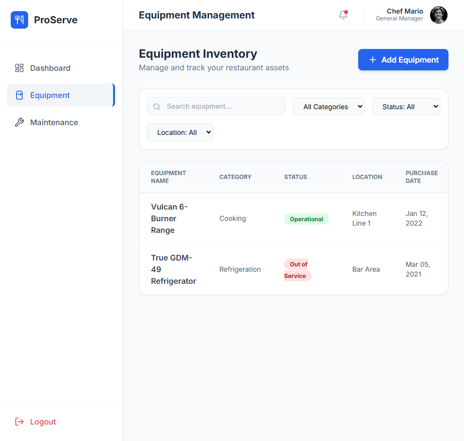
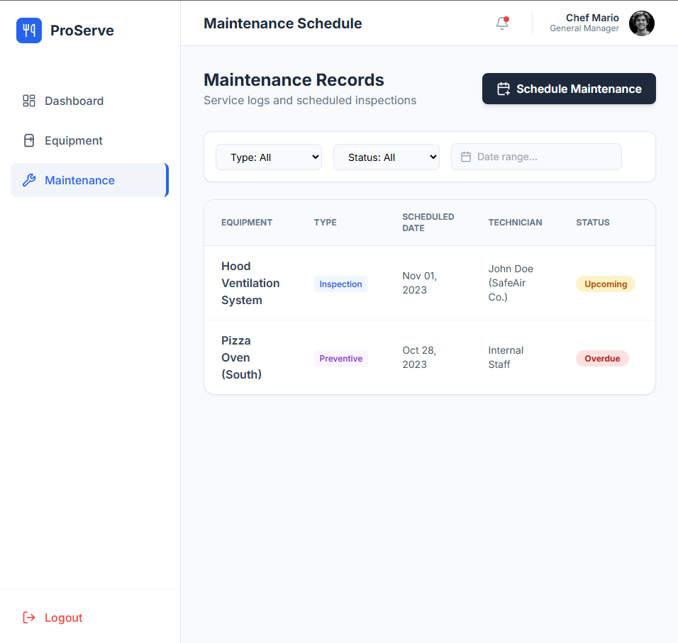
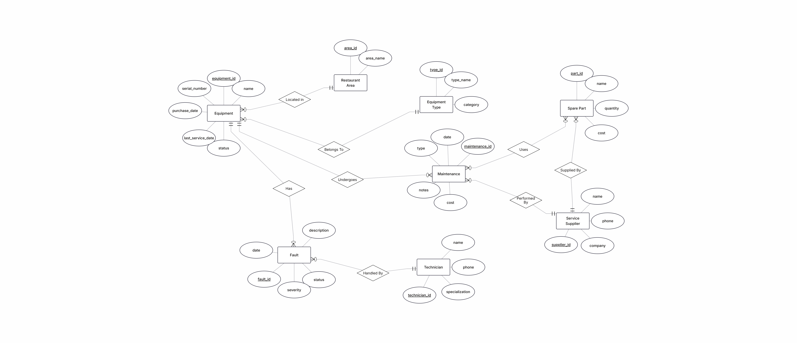
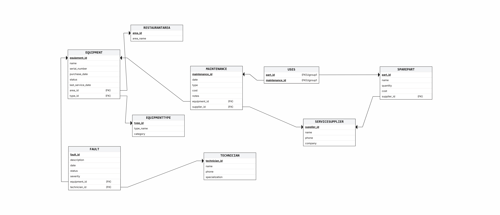

# Restaurant Equipment & Maintenance Management System

## Project Report - Stage 1 (שלב א)

**Authors:** Yair Chocron, Refael Sharvit
**Student IDs:** 214895013, 1894544
**System:** Restaurant Management
**Module:** Equipment & Maintenance
**Database:** PostgreSQL

---

## Table of Contents

1. [Introduction](#introduction)
2. [Screen Design (AI Studio)](#screen-design)
3. [ERD Diagram](#erd-diagram)
4. [DSD Diagram](#dsd-diagram)
5. [Data Structure Description](#data-structure-description)
6. [Design Decisions & Normalization (3NF)](#design-decisions--normalization-3nf)
7. [SQL Files](#sql-files)
8. [Data Insertion Methods](#data-insertion-methods)
9. [Backup & Restore](#backup--restore)

---

## Introduction

This database project models the **Equipment & Maintenance** module of a restaurant management system. The system stores and manages data related to restaurant equipment (ovens, refrigerators, dishwashers, ventilation systems, etc.), their areas within the restaurant, equipment types and categories, all maintenance operations performed on them, fault tracking and resolution, the spare parts inventory, service supplier relationships, and technician assignments.

### Main Functionality

- **Equipment tracking**: Register and manage all restaurant equipment by type, area, serial number, and status
- **Maintenance scheduling**: Plan and record preventive, corrective, emergency, and inspection maintenance operations
- **Fault management**: Track equipment faults with severity levels, assign technicians, and monitor resolution status
- **Spare parts management**: Track inventory levels and usage during maintenance operations
- **Technician assignment**: Assign qualified technicians to fault resolution based on their specialization
- **Service supplier management**: Maintain supplier information and track which suppliers provide maintenance and parts
- **Reporting**: Generate reports on maintenance costs, equipment status, fault analysis, and technician workload

---

## Screen Design

The system screens were designed using a **Top-Down** approach. We first defined all the screens of the final system using Google AI Studio, creating a complete application mockup (not connected to a database). These screens served as the basis for designing our database tables.

The application contains **9 screens**:

### Screen 1: Login
Split-panel login screen with system branding on the left and authentication form on the right.


### Screen 2: Dashboard
Main dashboard showing key metrics: total equipment count, active/under-repair equipment, critical maintenance alerts, active technicians, low-stock parts, active contracts, and monthly maintenance cost. Also displays a table of recent maintenance operations.



### Screen 3: Equipment Management
Full CRUD interface for managing restaurant equipment. Includes search/filter by type, status, and area. Table displays all equipment attributes including serial number, purchase date, last service date, and current status. Includes an "Add Equipment" form.



### Screen 4: Maintenance Management
Interface for managing all maintenance operations. Filter by maintenance type (Preventive/Corrective/Emergency/Inspection), date range, and supplier. Displays date, cost, notes, and associated supplier.



### Screen 5: Technician Management
Manage maintenance technicians with search by name and specialization filter. Displays phone and specialization.

<!--  -->
> *Insert screenshot of Technicians screen here*

### Screen 6: Spare Parts Inventory
Inventory management screen with stock level indicators. Filter by supplier. Shows quantity, cost per unit, and associated supplier.

<!--  -->
> *Insert screenshot of Spare Parts screen here*

### Screen 7: Service Supplier Management
Manage service suppliers with search by name and company. Displays phone and company information.

<!--  -->
> *Insert screenshot of Suppliers screen here*

### Screen 8: Fault Tracking
Fault management interface showing fault description, date, severity (Low/Medium/High/Critical), status (Open/In Progress/Resolved/Closed), associated equipment, and assigned technician.

<!--  -->
> *Insert screenshot of Fault Tracking screen here*

### Screen 9: Reports & Analytics
Reports dashboard with report types: Maintenance Cost Report, Equipment Status Summary, Fault Analysis Report, Technician Workload, and Parts Usage. Includes a sample monthly cost summary table.

<!--  -->
> *Insert screenshot of Reports screen here*

> **Note**: The complete interactive mockup is available in the file `system_screens.html`. Open it in a browser to navigate between all screens.

---

## ERD Diagram

The database was designed using **ERDPlus** (erdplus.com). The Entity-Relationship Diagram contains **8 entities** and **8 relationships** (including 1 many-to-many relationship that generates 1 additional junction table).



### Entities (8)

| # | Entity | Description | Key Attributes |
|---|--------|-------------|----------------|
| 1 | **RestaurantArea** | Areas/zones within the restaurant | area_id (PK), area_name |
| 2 | **EquipmentType** | Classification of equipment | type_id (PK), type_name, category |
| 3 | **ServiceSupplier** | Companies providing maintenance and parts | supplier_id (PK), name, phone, company |
| 4 | **Equipment** | Restaurant equipment and appliances | equipment_id (PK), name, serial_number, purchase_date, status, last_service_date |
| 5 | **Technician** | Maintenance staff and repair personnel | technician_id (PK), name, phone, specialization |
| 6 | **Maintenance** | Maintenance operations on equipment | maintenance_id (PK), date, type, cost, notes |
| 7 | **SparePart** | Replacement parts inventory | part_id (PK), name, quantity, cost |
| 8 | **Fault** | Equipment faults and issues | fault_id (PK), description, date, status, severity |

### Relationships (8)

| # | Relationship | Between | Cardinality |
|---|-------------|---------|-------------|
| 1 | Has_Type | Equipment → EquipmentType | N:1 |
| 2 | Located_In | Equipment → RestaurantArea | N:1 |
| 3 | Undergoes | Equipment → Maintenance | 1:N |
| 4 | Has_Fault | Equipment → Fault | 1:N |
| 5 | Serviced_By | Maintenance → ServiceSupplier | N:1 |
| 6 | Supplied_By | SparePart → ServiceSupplier | N:1 |
| 7 | Assigned_To | Fault → Technician | N:1 |
| 8 | Uses | Maintenance ↔ SparePart | **M:N** (via Uses) |

### Meaningful DATE Attributes (4 total, minimum required: 2)

1. `Equipment.purchase_date` - When the equipment was purchased
2. `Equipment.last_service_date` - When the equipment was last serviced
3. `Maintenance.date` - When the maintenance was performed
4. `Fault.date` - When the fault was reported

---

## DSD Diagram

The DSD (Data Structure Diagram) was generated from the ERD using ERDPlus. It shows the relational schema with all tables, columns, primary keys, and foreign key references.



### Resulting Tables (9)

The ERD translates to **9 relational tables**: 8 from entities + 1 from M:N relationship.

```
RestaurantArea (area_id PK, area_name)
    |
    | 1:N
    v
Equipment (equipment_id PK, name, serial_number, purchase_date,
           status, last_service_date, type_id FK, area_id FK)
    ^                                     |        |
    | N:1                                 | 1:N    | 1:N
EquipmentType (type_id PK,               v        v
               type_name, category)  Maintenance   Fault (fault_id PK,
                                    (maintenance_id PK,    description, date,
                                     date, type, cost,    status, severity,
                                     notes,               equipment_id FK,
                                     equipment_id FK,     technician_id FK)
                                     supplier_id FK)           |
                                         |    |                | N:1
                                         |    | M:N            v
                                         |    v           Technician (technician_id PK,
                                         | Uses              name, phone,
                                         | (maintenance_id    specialization)
                                         |  PK/FK,
                                         |  part_id PK/FK)
                                         |        |
                                         | N:1    v
                                         v   SparePart (part_id PK, name,
                                    ServiceSupplier       quantity, cost,
                                    (supplier_id PK,      supplier_id FK)
                                     name, phone,              |
                                     company)                  | N:1
                                         ^---------------------+
```

---

## Data Structure Description

### RestaurantArea
| Column | Type | Constraints |
|--------|------|-------------|
| area_id | INT | PRIMARY KEY |
| area_name | VARCHAR(100) | NOT NULL |

### EquipmentType
| Column | Type | Constraints |
|--------|------|-------------|
| type_id | INT | PRIMARY KEY |
| type_name | VARCHAR(100) | NOT NULL |
| category | VARCHAR(50) | |

### ServiceSupplier
| Column | Type | Constraints |
|--------|------|-------------|
| supplier_id | INT | PRIMARY KEY |
| name | VARCHAR(100) | NOT NULL |
| phone | VARCHAR(20) | |
| company | VARCHAR(100) | |

### Technician
| Column | Type | Constraints |
|--------|------|-------------|
| technician_id | INT | PRIMARY KEY |
| name | VARCHAR(100) | NOT NULL |
| phone | VARCHAR(20) | |
| specialization | VARCHAR(100) | |

### Equipment
| Column | Type | Constraints |
|--------|------|-------------|
| equipment_id | INT | PRIMARY KEY |
| name | VARCHAR(100) | NOT NULL |
| serial_number | VARCHAR(50) | UNIQUE |
| purchase_date | DATE | NOT NULL |
| status | VARCHAR(20) | DEFAULT 'Active', CHECK IN ('Active','Under Repair','Decommissioned','In Storage') |
| last_service_date | DATE | |
| type_id | INT | FK → EquipmentType |
| area_id | INT | FK → RestaurantArea |

### SparePart
| Column | Type | Constraints |
|--------|------|-------------|
| part_id | INT | PRIMARY KEY |
| name | VARCHAR(100) | NOT NULL |
| quantity | INT | DEFAULT 0, CHECK >= 0 |
| cost | NUMERIC(10,2) | CHECK >= 0 |
| supplier_id | INT | FK → ServiceSupplier |

### Maintenance
| Column | Type | Constraints |
|--------|------|-------------|
| maintenance_id | INT | PRIMARY KEY |
| date | DATE | NOT NULL |
| type | VARCHAR(30) | NOT NULL, CHECK IN ('Preventive','Corrective','Emergency','Inspection') |
| cost | NUMERIC(10,2) | |
| notes | VARCHAR(500) | |
| equipment_id | INT | NOT NULL, FK → Equipment |
| supplier_id | INT | FK → ServiceSupplier |

### Fault
| Column | Type | Constraints |
|--------|------|-------------|
| fault_id | INT | PRIMARY KEY |
| description | VARCHAR(500) | |
| date | DATE | NOT NULL |
| status | VARCHAR(20) | DEFAULT 'Open', CHECK IN ('Open','In Progress','Resolved','Closed') |
| severity | VARCHAR(10) | NOT NULL, CHECK IN ('Low','Medium','High','Critical') |
| equipment_id | INT | NOT NULL, FK → Equipment |
| technician_id | INT | FK → Technician |

### Uses (Junction Table)
| Column | Type | Constraints |
|--------|------|-------------|
| maintenance_id | INT | PK, FK → Maintenance |
| part_id | INT | PK, FK → SparePart |

---

## Design Decisions & Normalization (3NF)

### Design Decisions

1. **Top-Down approach**: We first designed the application screens to understand what data the system needs, then derived the database schema from those requirements.

2. **4 meaningful DATE fields** (above the minimum of 2):
   - `Equipment.purchase_date` and `Equipment.last_service_date` - equipment lifecycle tracking
   - `Maintenance.date` - maintenance operation tracking
   - `Fault.date` - fault reporting tracking

3. **Constraints** to ensure data integrity:
   - CHECK constraints on enumerated values (equipment status, maintenance type, fault status/severity)
   - CHECK constraints on non-negative values (quantities, costs)
   - DEFAULT values for common defaults (status='Active', quantity=0)
   - NOT NULL on critical fields
   - UNIQUE on serial_number
   - Named constraints for easy identification

4. **One Many-to-Many relationship** implemented via junction table:
   - `Uses` (Maintenance ↔ SparePart) - tracks which parts were used in which maintenance operation

5. **Separation of concerns**: Each entity represents a distinct real-world concept. No data duplication across tables.

### Normalization Verification (3NF)

All 9 tables were verified to be in **BCNF** (Boyce-Codd Normal Form), which is stronger than the required 3NF.

**Verification method:** For each table, we identified all functional dependencies and verified:
- **1NF**: All attributes are atomic (no repeating groups)
- **2NF**: No partial dependencies (no non-key attribute depends on part of a composite key)
- **3NF**: No transitive dependencies (no non-key attribute depends on another non-key attribute)

| Table | PK | Non-trivial FDs | 3NF? | BCNF? |
|-------|-----|----------------|------|-------|
| RestaurantArea | area_id | area_id → all others | Yes | Yes |
| EquipmentType | type_id | type_id → all others | Yes | Yes |
| ServiceSupplier | supplier_id | supplier_id → all others | Yes | Yes |
| Equipment | equipment_id | equipment_id → all others; serial_number → equipment_id (candidate key) | Yes | Yes |
| Technician | technician_id | technician_id → all others | Yes | Yes |
| SparePart | part_id | part_id → all others | Yes | Yes |
| Maintenance | maintenance_id | maintenance_id → all others | Yes | Yes |
| Fault | fault_id | fault_id → all others | Yes | Yes |
| Uses | (maintenance_id, part_id) | Composite PK, no non-key attributes | Yes | Yes |

> Full detailed verification available in `3NF_verification.md`

---

## SQL Files

The following SQL files are the main deliverables for Stage 1. They are located in the `שלב א/` directory:

| File | Description |
|------|-------------|
| `createTables.sql` | Creates all 9 tables with their columns, data types, constraints, and foreign keys. Runs without errors on a clean database. |
| `dropTables.sql` | Drops all 9 tables in dependency-safe order (child tables first) to avoid foreign key violations. |
| `insertTables.sql` | The **master insertion file** — serves as the central entry point for populating the entire database. It calls all generated SQL files from the 3 data insertion methods (see below). |
| `selectAll.sql` | Contains `SELECT *` statements for all 9 tables to display and verify the inserted data. |

### insertTables.sql — Master Insertion File

`insertTables.sql` is the main file that populates the database. Rather than containing all INSERT statements directly, it uses PostgreSQL's `\i` command to include the SQL files generated by each data insertion method. This keeps the project organized and modular.

Example structure:

```sql
-- insertTables.sql
-- Master insertion file: calls all generated data files

\i generatedataFiles/RestaurantArea.sql
\i generatedataFiles/EquipmentType.sql
\i mockarooFiles/ServiceSupplier.sql
\i mockarooFiles/Technician.sql
\i Programing/Equipment_Insert.sql
\i mockarooFiles/SparePart.sql
\i Programing/Maintenance_Insert.sql
\i Programing/Fault_Insert.sql
\i generatedataFiles/Uses.sql
```

---

## Data Insertion Methods

Data was generated using **3 different methods** as required. Each table contains at least **500 records**. Two tables (Maintenance and Fault) contain **20,000 records** each. **Total: 43,500 records.**

All generated SQL files are called from `insertTables.sql` (the master insertion file described above).

### Method 1: Python Scripts (Programing/)

Used for the three largest tables:
- **Equipment** (500 rows) — `generate_equipment.py` → `Equipment_Insert.sql`
- **Maintenance** (20,000 rows) — `generate_maintenance.py` → `Maintenance_Insert.sql`
- **Fault** (20,000 rows) — `generate_fault.py` → `Fault_Insert.sql`

> *Insert screenshots of Python script execution here*

### Method 2: Mockaroo (mockarooFiles/)

Used for:
- **ServiceSupplier** (500 rows) — `ServiceSupplier.sql`
- **Technician** (500 rows) — `Technician.sql`
- **SparePart** (500 rows) — `SparePart.sql`

> *Insert screenshots of Mockaroo configuration here*

### Method 3: Generatedata (generatedataFiles/)

Used for:
- **RestaurantArea** (500 rows) — `RestaurantArea.sql`
- **EquipmentType** (500 rows) — `EquipmentType.sql`
- **Uses** (500 rows) — `Uses.sql`

> *Insert screenshots of Generatedata configuration here*

### Data Summary

| Table | Records | Generation Method | SQL File |
|-------|---------|-------------------|----------|
| RestaurantArea | 500 | Generatedata | `generatedataFiles/RestaurantArea.sql` |
| EquipmentType | 500 | Generatedata | `generatedataFiles/EquipmentType.sql` |
| ServiceSupplier | 500 | Mockaroo | `mockarooFiles/ServiceSupplier.sql` |
| Technician | 500 | Mockaroo | `mockarooFiles/Technician.sql` |
| Equipment | 500 | Python | `Programing/Equipment_Insert.sql` |
| SparePart | 500 | Mockaroo | `mockarooFiles/SparePart.sql` |
| Maintenance | 20,000 | Python | `Programing/Maintenance_Insert.sql` |
| Fault | 20,000 | Python | `Programing/Fault_Insert.sql` |
| Uses | 500 | Generatedata | `generatedataFiles/Uses.sql` |
| **Total** | **43,500** | | |

---

## Backup & Restore

### Backup
The database was backed up using pgAdmin's backup utility (custom format).

> *Insert screenshot of backup process here*

**Backup file:** `backup_2026_03_23.backup`

### Restore
The backup was successfully restored on a different machine to verify data integrity.

> *Insert screenshot of restore process here*

---
